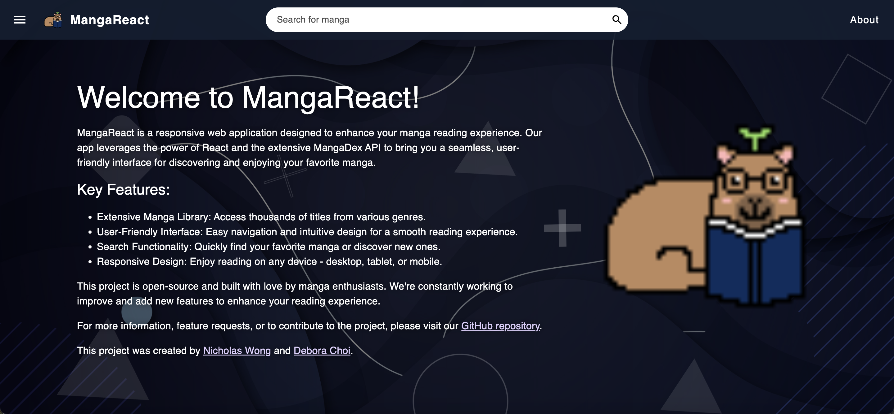

## Welcome to MangaReact!

MangaReact is a responsive web application designed to enhance your manga reading experience. Our app leverages the power of React and the extensive MangaDex API to bring you a seamless, user-friendly interface for discovering and enjoying your favorite manga.

## Demo Video

[](https://www.youtube.com/watch?v=iaZjLGuwVN4&feature=youtu.be)

Click the image above to watch the demo video on YouTube.

## Key Features:
- **Extensive Manga Library**: Access thousands of titles from various genres.
- **User-Friendly Interface**: Easy navigation and intuitive design for a smooth reading experience.
- **Search Functionality**: Quickly find your favorite manga or discover new ones.
- **Responsive Design**: Enjoy reading on any device - desktop, tablet, or mobile.

## Authors
This project was created by [Nicholas Wong](https://www.linkedin.com/in/nicholas-wong-110b2b231/) and [Debora Choi](https://www.linkedin.com/in/debora-choi-759b221a9/).

## Getting Started

To set up and run the project locally, follow these steps:

1. **Install dependencies:**
   ```bash
   npm install
   ```
2. **Check the installed Node version:**
   ```bash
   npm -v
   ```
3. **Update dependencies (if needed):**
   ```bash
   npm update
   ```
4. **Start the development server:**
   ```bash
   npm start
   ```

## Screenshots:



